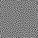
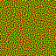
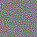

# Dithering Mask generator

Implementation of Mask generation - ["Blue-noise dithered sampling"](https://www.arnoldrenderer.com/research/dither_abstract.pdf), Georgiev and Fajardo, 2016

Note that for 1D-large mask, it is better to use Jeremy Dupuy's implementation: https://github.com/jdupuy/BlueNoiseDitherMaskTiles
His implementation uses cluster-and-void and is GPU accelerated.

Here this code can compute arbitrary mask dimension on CPU. The code use cluster-and-void for 1D approaches. For higher dimension, a simple anneling method with auto-tuning temperature is used.

Example to generate 32x32 masks of different dimensions:
```
cargo run --release -- 64 1 mask_d1
cargo run --release -- 64 2 mask_d2
cargo run --release -- 64 3 mask_d3
```
Example output:

| Dim 1  | Dim 2 | Dim 3 |
| ------------- | ------------- | ------------- |
|  |  |  |

The command also output `.mask` file. This file contains an header flag: `MASK\n {size} {size} {dimension}\n-1.0\n` then the floating point value of the mask. This simple format is easy to integrate inside your own renderer.

```
let header = format!("MASK\n{} {} {}\n-1.0\n", size, size, dimension);
file.write_all(header.as_bytes()).unwrap();
for d in 0..dimension {
    for y in 0..size {
        for x in 0..size {
            let p = img[d as usize][get_index((x, y))];
            file.write_f32::<LittleEndian>(p.abs()).unwrap();
        }
    }
}
```

## Other implementations
- https://github.com/bartwronski/BlueNoiseGenerator